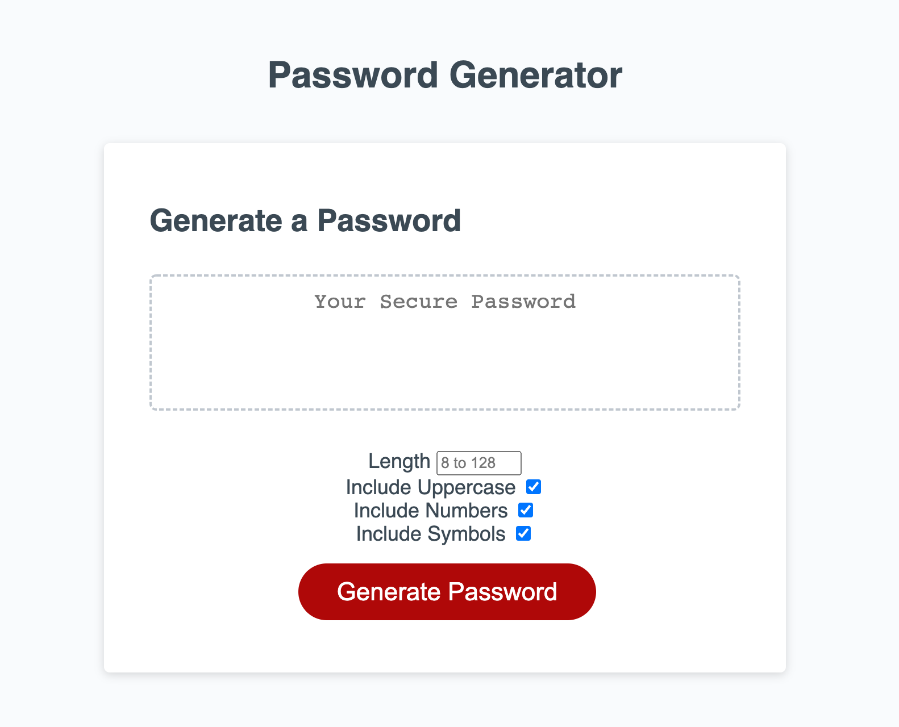

# UWCB-03-Homework
UW Coding Bootcamp : Homework 03

## Description

This password generator creates a random password based on the user's form input: Length count (from 8-128) plus the option to make the password more complex by adding Uppercase, Number, and Symbol characters. The Length field is required, but choosing Uppercase, Number, or Symbol is optional.

I've taken the criteria and tried to improve upon it from a user experience perspective. First, by including form fields on the page instead of relying on prompts. And second, the password includes lowercase characters by default which makes it so that the user can still create a password without selecting any of the options (Uppercase, Number, Symbol).

## Page Link
<a href="https://pdubya1632.github.io/UWCB-03-Homework/index.html">https://pdubya1632.github.io/UWCB-03-Homework/index.html</a>
## Preview

